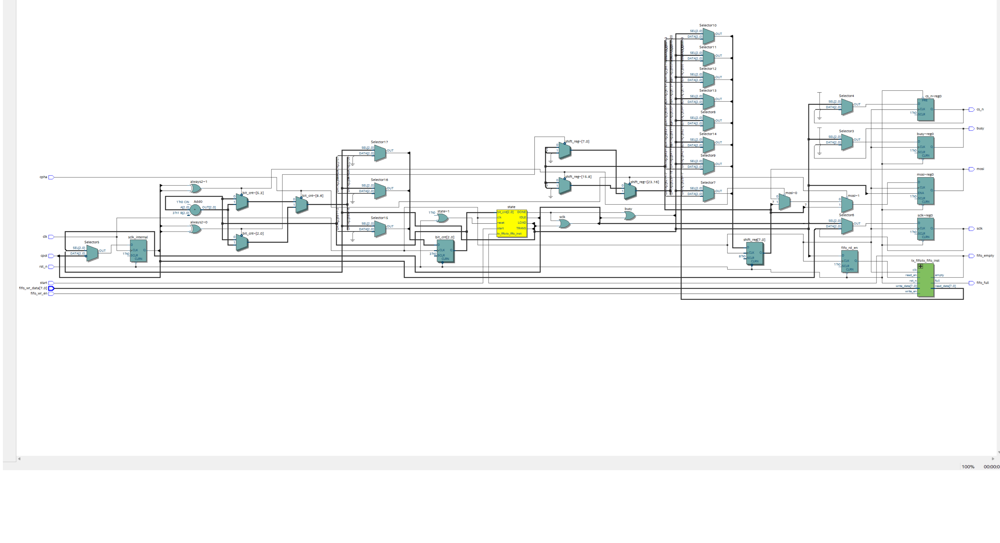
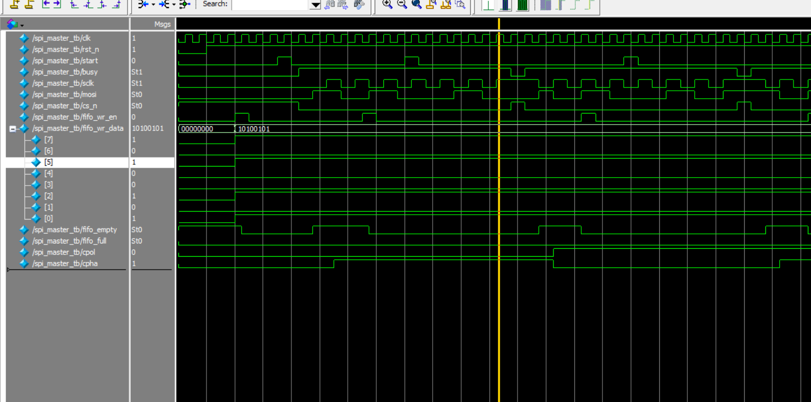

# SPI Master with FIFO and CPOL/CPHA Mode Support

This project implements a Verilog-based SPI Master with configurable CPOL/CPHA modes (SPI Mode 0~3), and an integrated FIFO transmit buffer.  
It includes a testbench and simulation results validated using ModelSim.

---

## 📌 Features

- ✅ SPI Master with FSM control
- ✅ Support for SPI Modes 0, 1, 2, 3 (via CPOL/CPHA)
- ✅ FIFO-based transmit buffer (16-depth, configurable)
- ✅ Fully synchronous design (based on system clock)
- ✅ Testbench with automatic CPOL/CPHA switching
- ✅ Waveform validation

---

## 📁 Files Overview

| File | Description |
|------|-------------|
| `spi_master.v` | SPI master module with CPOL/CPHA & FIFO integration |
| `tx_fifo.v` | Simple transmit-side FIFO buffer |
| `spi_master_tb.v` | Verilog testbench for Mode 0~3 functional verification |
| `RTL_spi_master.png` | RTL block diagram |
| `wave_spi_master_tb.png` | Simulation waveform capture |

---

## 🧠 RTL Architecture



---

## 🧪 Simulation: CPOL/CPHA Mode Testing

The testbench sweeps through all 4 SPI modes:

| Mode | CPOL | CPHA |
|------|------|------|
| 0    |  0   |  0   |
| 1    |  0   |  1   |
| 2    |  1   |  0   |
| 3    |  1   |  1   |

Each test writes one byte (e.g. `0xA5`) to the FIFO, triggers SPI transfer, and verifies `sclk`, `mosi`, `cs_n` behavior.

📷 **Waveform:**


> You can observe correct polarity, phase behavior, and bit shifting over time.

---

## ▶ How to Simulate (ModelSim)

```tcl
vlog spi_master.v tx_fifo.v spi_master_tb.v
vsim spi_master_tb
add wave *
run -all
